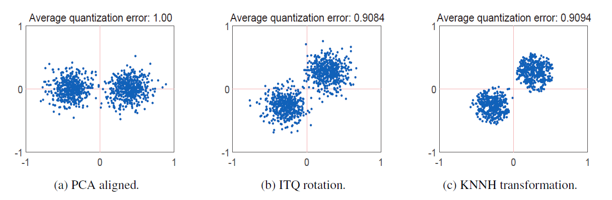
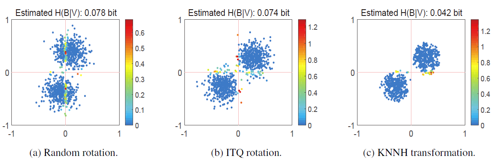

# K-Nearest-Neighbors-Hashing
Matlab implementation of "K-Nearest Neighbors Hashing".

### Dependencies :
* **MatLab >= R2016b** (GPU support knnsearch)
* MatLab <= R2016a (CPU only knnsearch)

### How to use ?
1. Download datasets and unzip to `./datasets`
2. Edit `SETTING` part in `demo.m`:
```matlab
%% SETTING
num_bits = 16;
dataset = 'cifar10'; % cifar10, mnist, labelme, Places205
feature_type = 'vggfc7'; % gist, vggfc7, uint (MINIST only), alexnet (Places205 only)

gpuDevice_ID = 1; % if CPU-only / you don't want to use GPU, just set it as -1

ITER = 10; % run ITER times
K = 20; % 200 for Places205
%%
```

### Datasets :
OneDrive | gist | vggfc7 | uint | alexnet
------------ | ------------- | ------------- | ------------- | -------------
Cifar10 | ✓  | ✓  | ☐  | ☐ 
MNIST |✓ | ☐  | ✓ | ☐ 
Labelme | ✓ | ✓ | ☐  | ☐ 
Places205 | ☐  | ☐  | ☐  | ✓

Baidu Pan | gist | vggfc7 | uint | alexnet
------------ | ------------- | ------------- | ------------- | -------------
Cifar10 | [✓](https://pan.baidu.com/s/1nh-1F3imSeG7KErYWp5ERQ) (irou)  | [✓](https://pan.baidu.com/s/14YyiDcgSX_0zsewwpuVkFg) (0hr5) | ☐  | ☐ 
MNIST |[✓](https://pan.baidu.com/s/1C6dct3FvRLw1W7eM3kcSGQ) (6d29) | ☐  | [✓](https://pan.baidu.com/s/1H0qRPFWvlUfU7KGmOM1GYw) (masv) | ☐ 
Labelme | [✓](https://pan.baidu.com/s/1jddzOdGIzPcSzxIxsC2L2A) (47ny) | [✓](https://pan.baidu.com/s/11gFaGeu0sljMgjCdGWn4Og) (b7na) | ☐  | ☐ 
Places205 | ☐  | ☐  | ☐  | [✓](https://pan.baidu.com/s/1rvKXkl6amuwhjsf2I_s8NQ) (opw9)

`uint` refers to MNIST 784-D (28x28) gray-scale feature vector, which is represented by uint8.

### Brief Intro :


MSE may not lead to the optimal binary representation. We propose to use the conditional entropy as the criterion to refine the previous method.



### Acknowlegment :
We would like to thank the authors of [Gemb](https://github.com/hnanhtuan/Gemb) and [MiHash](https://github.com/fcakir/mihash) for sharing their codes! This project is built on previous methods such as [ITQ](http://www.cs.unc.edu/~lazebnik/publications/cvpr11_small_code.pdf), [BA](https://arxiv.org/abs/1501.00756), [KMH](http://kaiminghe.com/publications/cvpr13kmh.pdf), [SH](https://papers.nips.cc/paper/3383-spectral-hashing), [PCAH](http://www.ee.columbia.edu/ln/dvmm/publications/12/PAMI_SSHASH.pdf) and [SPH](https://sglab.kaist.ac.kr/Spherical_Hashing/Spherical_Hashing.pdf).

### References :
```bib
@article{KNNH,
  author    = {Xiangyu He and Peisong Wang and Jian Cheng},
  title     = {K-Nearest Neighbors Hashing},
  booktitle = {2019 {IEEE} Conference on Computer Vision and Pattern Recognition},
  month     = {July},
  year      = {2019}
}
```
